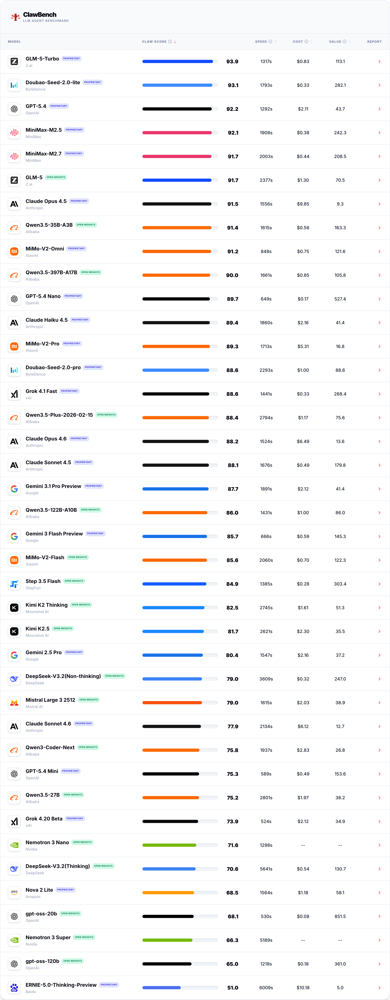
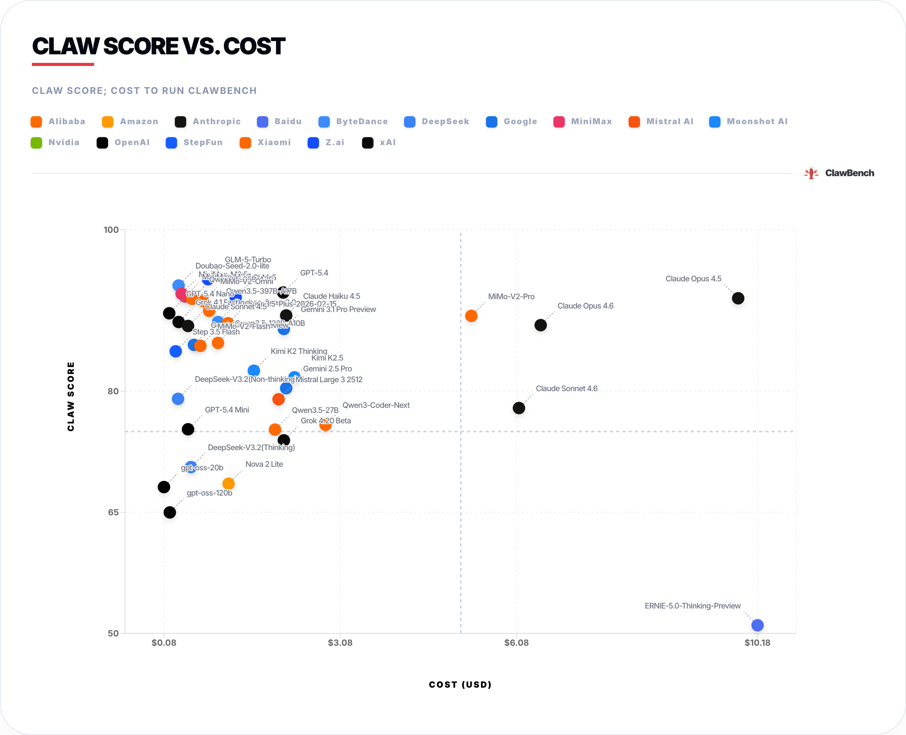
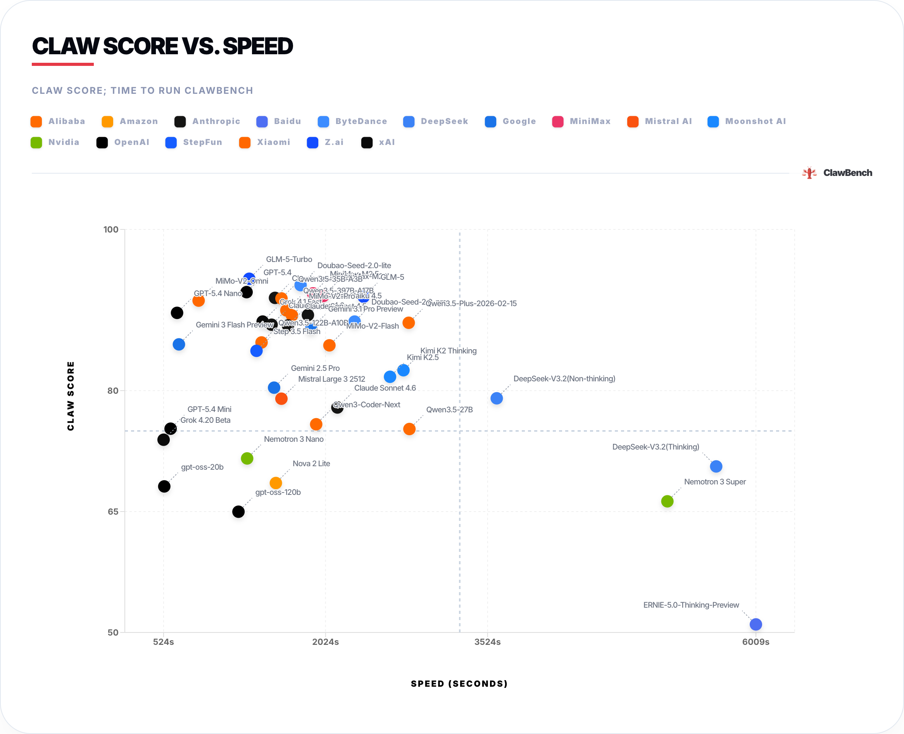
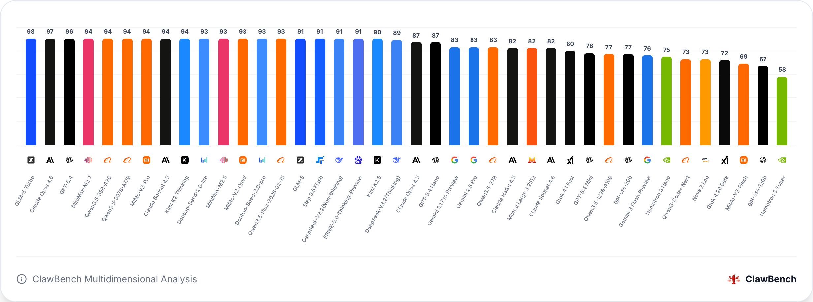
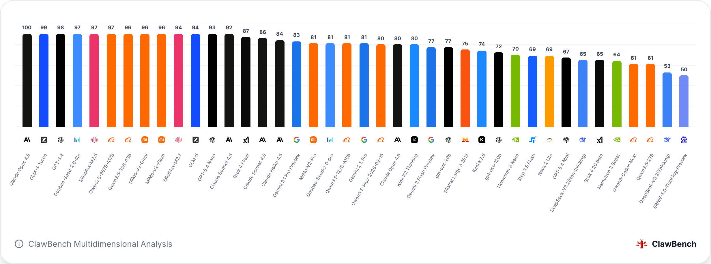
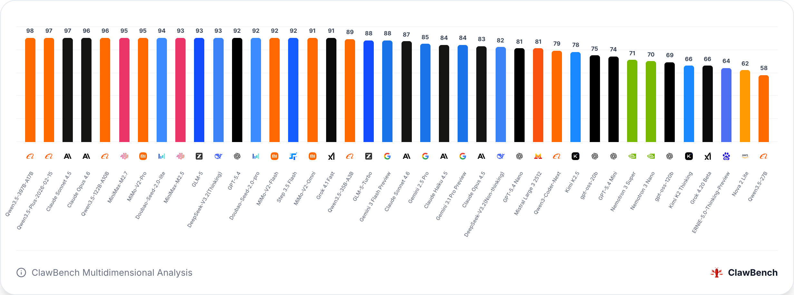
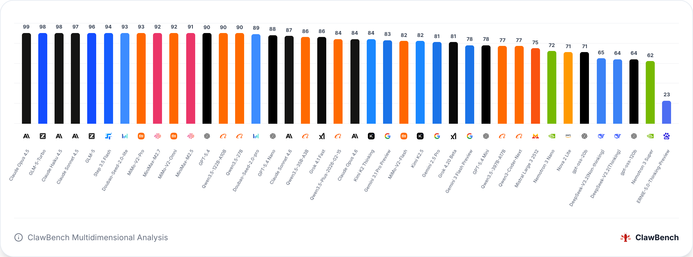
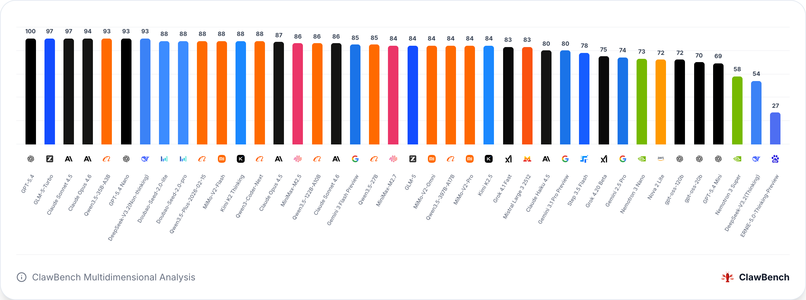

# ⚡️ Welcome to the Official ClawBench Page

**ClawBench** is an LLM Agents evaluation benchmark designed to address the limitations of traditional "QA-style" leaderboards, which often fail to reflect a model's true performance in complex workflows. We have constructed an isolated sandbox environment featuring 30 advanced tasks that comprehensively cover 5 core business scenarios: Office Collaboration, Information Retrieval, Content Creation, Data Processing, and Software Engineering.

Unlike single-dimensional Q&A tests, ClawBench intentionally embeds real-world engineering challenges such as "naming inconsistencies," "missing directories," and "date traps." By pioneering a Hybrid Grading mechanism, ClawBench not only precisely audits the code and data generated by Agents using Dynamic Ground Truth but also deeply evaluates the rigor of their business logic and compliance awareness. This provides the most credible capability metrics for the real-world deployment of LLM Agents.

---

## 🏆 Latest LLM Leaderboard

**Office Collaboration**

**Information Retrieval and Research**

**Content Creation**

**Data Processing and Analysis**

**Software Engineering**

> **Note**: All data is rigorously tested within the ClawBench isolated sandbox environment to ensure fairness, security, and zero bias.

---

## Evaluation Dimension

Based on real-world enterprise workflows, ClawBench conducts its evaluations across five core dimensions:

Office Collaboration：Evaluates the LLM's automated scheduling and document processing capabilities in daily office scenarios, covering logical reasoning tasks like meeting coordination, multi-step financial accounting, and cross-departmental asset provisioning.

Information Retrieval and Research：Assesses the LLM's ability to scrape data across sources, comprehend reading materials, and utilize long-term memory. It requires the LLM to accurately extract and synthesize high-value commercial and industry insights from massive noise.

Content Creation：Tests the model's performance in long-text generation, cross-modal tool invocation, and style transformation. It emphasizes the ability to output professional content and conduct business compliance audits under strict formatting constraints.

Data Processing and Analysis：Focuses on measuring the LLM's ability to clean unstructured and dirty data, perform relational analysis, detect anomalies, and forecast business trends. It requires the generation of accurate business insights and automated reports.

Software Engineering：Examines the Agent's end-to-end programming practices in real-world development environments, covering complex log troubleshooting, code bug diagnosis, automated environment provisioning, and system configuration refactoring.

## Evaluation Methodology

ClawBench abandons traditional static Q&A testing in favor of an evaluation architecture that highly simulates real-world enterprise development environments. Our methodology is built upon two core pillars:

**Isolated Sandboxed Execution**

To test an LLM's true operational capability, every Agent in ClawBench runs inside a strictly isolated virtual sandbox. Before a task begins, the sandbox is provisioned with specific business assets (e.g., dirty CSV files, system logs, or configuration manifests). The Agent must complete the workflow by actually invoking tools, reading/writing files, or executing code. 

**Tri-fold Grading Mechanism**

Because our 30 tasks span vastly different domains—from data parsing to creative business reporting—a one-size-fits-all grading rule is inadequate. Therefore, ClawBench designates one of the following three grading types for each specific task:

***Automated：***

Best For: Tasks with deterministic outcomes and strict formatting constraints (e.g., API config setup, JSON data ETL).

How it Works: Pure Python scripts execute automated assertions. These scripts deeply inspect workspace artifacts and structured schemas, often calculating a "Dynamic Ground Truth" at runtime to perform 100% precise, byte-level comparisons against the Agent's output.

***LLM Judge Grading***

Best For: Tasks emphasizing qualitative analysis, content generation, and logical reasoning (e.g., script creation, market research reports).

How it Works: Employs frontier LLMs as "expert judges." Guided by highly concrete, unambiguous scoring rubrics, the judge conducts a multi-dimensional, subjective review of the Agent's methodological logic, tone, and business acumen.

***Hybrid Grading***

Best For: Complex workflows that require both hard engineering constraints and soft business communication (e.g., anomaly detection, sales forecasting).

How it Works: Combines the strengths of both approaches. Automated scripts secure the objective baseline (e.g., math accuracy, strict negative constraints against PII leakage), while the LLM Judge evaluates the high-level business insights. The final score is a weighted combination (typically 50/50) of both assessments.

## Task Instruction

| Category | Task Name | Grading Type | Task Description |
| :--- | :--- | :--- | :--- |
| Office Collaboration | Meeting Coordination | automated | Read team schedules and coordinate the optimal meeting time while strictly avoiding conflicts, outputting standard JSON. |
| Office Collaboration | Weather Check | automated | Write and execute a Python script to simulate weather data, and generate travel recommendations based on the business trip itinerary. |
| Office Collaboration | Meeting Summary | hybrid | Extract core budget reduction decisions and time-bound action items from extensive meeting minutes. |
| Office Collaboration | Interview Invitation | llm_judge | Extract candidate PII and use temporal logic reasoning (based on the current date) to generate a formatted JSON email. |
| Office Collaboration | Travel Reimbursement | hybrid | Extract financial fragments from unstructured dialogue and execute precise multi-step calculations to generate an audit-ready CSV. |
| Office Collaboration | Onboarding Asset Provisioning | automated | Generate separate requisition tickets for IT (equipment) and HR (permissions) based on a new hire's specific role. |
| Information Retrieval and Research | Stock Price Research | automated | Fetch real-time stock prices and the latest financial report highlights to generate a research summary. |
| Information Retrieval and Research | Email Retrieval | hybrid | Read multiple emails, filter out irrelevant noise, and accurately track a project's budget and timeline evolution. |
| Information Retrieval and Research | News Briefing | hybrid | Search and summarize top news headlines about "Embodied AI" from the past 24 hours. |
| Information Retrieval and Research | Report Comprehension | automated | Extract core data points from the report and output to strict text format. |
| Information Retrieval and Research | Market Research | hybrid | Analyze architectures, business models, and supply chain trends of top AI chip vendors to generate a structured competitive analysis. |
| Information Retrieval and Research | Long-term Memory Retrieval | hybrid | Retrieve and read files across cross-cycle sessions to extract hidden parameters and compile them into a script. |
| Content Creation | Blog Writting | llm_judge | Draft a highly readable blog post on a designated topic, ensuring a well-organized structure and clearly articulated perspectives. |
| Content Creation | Report Summarization | llm_judge | Read the DeepSeek-R1 technical report and output a professional summary for AI researchers under extremely strict word and structure limits. |
| Content Creation | Content Transformation | llm_judge | Rewrite a boring "System Update Log" into a lively, engaging social media post. |
| Content Creation | Scipt Creation | hybrid | Write a professional 30-second video commercial script including storyboards and visual cues. |
| Content Creation | Pitch Deck Structuring | hybrid | Distill a lengthy business plan into a strictly formatted 10-slide pitch deck. |
| Content Creation | Content Audit | hybrid | Accurately correct parameters and data in a press release draft based on official documents, outputting a changelog while preserving the original marketing tone. |
| Data Processing and Analysis | Data Cleaning & ETL | hybrid | Perform automated cleaning and transformation from unstructured JSONL logs into standard reporting formats. |
| Data Processing and Analysis | Data Integration | hybrid | Correctly join CSV order tables with Excel payment tables, outputting a diff report. |
| Data Processing and Analysis | Data Anomaly Detection | hybrid | Write a script to identify the specific month with a sudden 50% drop in sales and perform a root-cause analysis. |
| Data Processing and Analysis | Visual Report | hybrid | Generate descriptive statistics from CSV data, recommend plotting types, and output a compelling executive business report. |
| Data Processing and Analysis | Pii Redaction | hybrid | Identify and compliantly mask sensitive PII (phones, names, bank cards) in documents. |
| Data Processing and Analysis | Sales Forecasting | hybrid | Predict future demand trends from historical data and calculate an optimal procurement restock plan. |
| Software Engineering | Log Triage | automated | Parse log files, conditionally segregate lines based on "ERROR" keyword frequency, and generate a statistical summary report. |
| Software Engineering | API Config Setup | automated | Filter keys meeting specific security rules from raw files and automatically construct a secure configuration file. |
| Software Engineering | Environment Provisioning | automated | Automatically scaffold folders, dependency lists, and configs based on a project manifest, and write a practical self-check utility script. |
| Software Engineering | E2E Scripting | automated | Automatically scrape images from a webpage and archive them systematically based on the current system date. |
| Software Engineering | Bug Diagnosis and Fix | automated | Diagnose and patch a fatal crashing bug in existing code without breaking the original pipeline functionalities. |
| Software Engineering | Code Refactoring | automated | Simulate a migration scenario by safely extracting hardcoded sensitive info into environment variables and updating manifests. |

## 🚀 Coming Soon**The official ClawBench website and full interactive leaderboard are launching soon!** You will be able to experience dynamic data filtering, detailed model comparisons, and comprehensive task breakdown reports.

📧 **Contact Us**: [clawbench@gmail.com]
